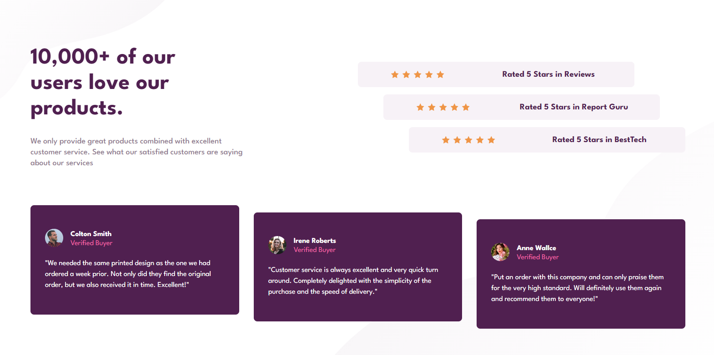

# Frontend Mentor - Social proof section solution

This is a solution to the [Social proof section challenge on Frontend Mentor](https://www.frontendmentor.io/challenges/social-proof-section-6e0qTv_bA). Frontend Mentor challenges help you improve your coding skills by building realistic projects. 

## Table of contents

  - [Table of contents](#table-of-contents)
  - [Overview](#overview)
    - [The challenge](#the-challenge)
    - [Screenshot](#screenshot)
    - [Links](#links)
  - [My process](#my-process)
    - [Built with](#built-with)
    - [What I learned](#what-i-learned)
  - [Author](#author)

## Overview

### The challenge

Users should be able to:

- View the optimal layout for the section depending on their device's screen size

### Screenshot

### Links

- Solution URL: [Github](https://github.com/Adeem-Treef/social-proof-section)
- Live Site URL: [Netlify](https://main-social-proof-solution.netlify.app/)

## My process

### Built with

- Semantic HTML5 markup
- CSS custom properties
- Flexbox
- CSS Grid

### What I learned
I learned a lot of things during this project, I was able to comfortable practice how to create a layout inside a layout using CSS flexbox and Grid.

## Author

- Website - (https://all-my-projects.netlify.app/)
- Frontend Mentor - (https://www.frontendmentor.io/profile/Adeem-Treef)
- Twitter - (https://www.twitter.com/AdeemTreef)